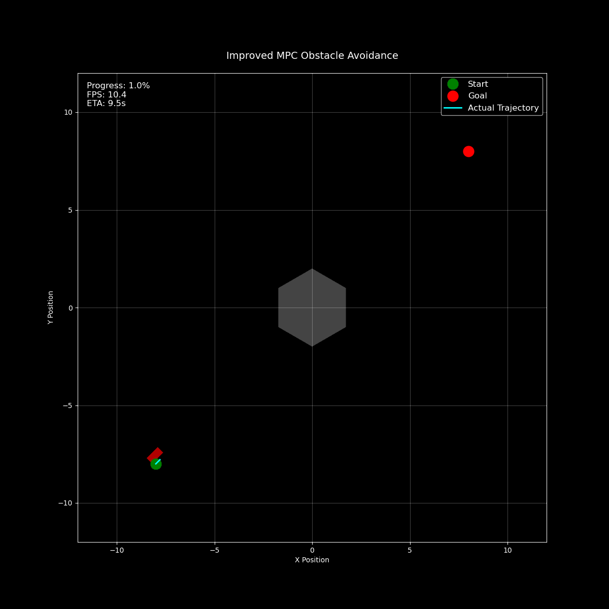

# OptimzationHW

## 效果展示



# 自动驾驶避障模型预测控制(MPC) - 演示实现

本仓库包含了一个简化版的基于MPC的自动驾驶避障算法实现。该实现作为概念验证，相比完整的生产系统包含了几个关键的简化。

## 主要简化

### 环境假设简化
1. **单个障碍物**：演示仅考虑单个六边形障碍物，而实际场景中会涉及多个不规则形状的障碍物
2. **无车道约束**：实现忽略了道路和车道边界，本质上是在开阔场地中的运动模拟
3. **静态环境**：障碍物是静止的，实际场景需要处理移动障碍物
4. **完美可见性**：未考虑天气条件、光照或传感器限制
5. **简化了YOLO**：简单认为Yolov5 生成六边形的包络

### 车辆模型简化
1. **自行车模型**：使用简化的自行车模型作为车辆动力学，忽略了：
   - 轮胎打滑和摩擦效应
   - 空气动力学力
   - 道路坡度和倾斜
   - 车辆重量转移
   - 悬架动力学

2. **控制输入**：仅考虑基本控制输入：
   - 加速度 (a)
   - 转向角 (δ)
   忽略了更复杂的车辆控制，如档位选择、制动分配等

### 优化问题简化
1. **障碍物表示**：使用规则六边形表示障碍物，而不是处理不规则形状
2. **线性近似**：
   - 使用一阶泰勒展开处理三角函数项
   - 对转向采用小角度近似 (tan(δ) ≈ δ)
3. **固定时间步长**：使用恒定时间步长(dt)而不是可变时间步长
4. **单一规划视野**：使用固定的预测时域长度

### 感知系统简化
1. **完美状态估计**：假设完全知道车辆状态
2. **无传感器融合**：未实现实际的多源传感器融合
3. **简化的不确定性模型**：使用基本的高斯模型处理位置不确定性
4. **非实时处理**：动画是预先计算而不是实时执行

## 演示功能
该演示展示了：
1. 基本的MPC避障实现
2. 使用简化约束的凸优化方法
3. 车辆轨迹的基本动画
4. 与六边形障碍物的简单碰撞检查
5. 规划结果的可视化

## 局限性
此演示仅用于教育目的和算法验证，不适用于：
1. 实际自动驾驶应用
2. 安全关键系统
3. 高速或紧急机动
4. 复杂交通场景
5. 生产部署

## 环境要求
- Python 3.x
- NumPy
- Matplotlib
- SciPy
- Numba
- tqdm

## 使用方法
运行主脚本以生成避障行为的动画：
```python
python update.py
```

主要改进:

1. 增加预测步长N（10→20）:
   - 让MPC能够"看得更远"
   - 有助于提前规划避障路径
   - 生成更平滑的轨迹

2. 代价函数的改进:
   - 距离代价: 引导车辆向目标点移动
   - 碰撞代价: 避免与障碍物碰撞
   - 接近代价: 在接近障碍物时增加惩罚
   - 平滑代价: 使车辆运动更加平滑
